# Foxhound Pipeline — Normalized Schema (v4)

```mermaid
erDiagram
    %% ---------- lookups ----------
    countries ||--o{ business_listings : "country_code"
    categories ||--o{ business_listings : "category_id"
    categories ||--o{ business_listings : "niche_category_id"
    platforms  ||--o{ social_profiles  : "platform_id"

    %% ---------- queue spine ----------
    queries ||--o{ serp_jobs        : "parent_job_id"
    queries ||--o{ serp_results     : "source_query_id"
    queries ||--o{ enrichment_jobs  : "parent_query_id"
    serp_jobs ||--o{ serp_results   : "source_serp_id"

    %% ---------- enrichment -> canonical ----------
    serp_results     ||..o{ enrichment_jobs : "trg_enqueue_enrichment (url_hash)"
    enrichment_jobs  ||..o{ business_listings : "trg_normalize_enrichment (upsert domain)"
    enrichment_jobs  ||..o{ emails            : "trg_normalize_enrichment (raw_emails)"

    %% ---------- business <-> children ----------
    business_listings ||--o{ business_emails   : "business_id (CASCADE)"
    emails            ||--o{ business_emails   : "email_id (CASCADE)"
    business_listings ||--o{ business_phones   : "business_id (CASCADE)"
    business_listings ||--o{ social_profiles   : "business_id (CASCADE)"

    %% ---------- matview ----------
    categories        ||..o{ category_stats : "matview GROUP BY category_id"
    business_emails   ||..o{ category_stats : "matview COUNT emails"

    %% ============ LOOKUPS ============
    countries {
        char_2 code PK "ISO-3166-1 alpha-2"
        text name
        boolean enabled "whitelist gate (was app-enforced)"
    }

    categories {
        smallserial id PK
        text slug UK "yoga|pilates|fitness|..."
        text label
        boolean is_niche "true = counts toward niche_category"
    }

    platforms {
        smallserial id PK
        text slug UK "tiktok|youtube|telegram|instagram|facebook|..."
        text label
        text base_url "for reconstructing full handle URL"
    }

    %% ============ QUEUE SPINE ============
    queries {
        bigserial id PK
        text text
        text text_hash UK
        text status "default pending"
        char_2 country FK "-> countries.code"
        integer result_count
        text error_msg
        timestamptz expanded_at "auto-expand depth cap"
        timestamptz created_at
        timestamptz updated_at
    }

    serp_jobs {
        text id PK
        bigint parent_job_id FK "-> queries.id"
        integer priority
        text search_url
        integer page_num
        text engine "default google"
        text status "default new"
        integer attempt_count "never reset to 0"
        integer max_attempts "default 3"
        timestamptz next_attempt_at
        text locked_by
        timestamptz locked_at
        timestamptz picked_at
        integer result_count
        text error_msg
        timestamptz created_at
        timestamptz updated_at
    }

    serp_results {
        bigserial id PK
        text url
        text url_hash UK
        text domain
        bigint source_query_id FK "-> queries.id"
        text source_serp_id FK "-> serp_jobs.id"
        timestamptz created_at
    }

    enrichment_jobs {
        uuid id PK "gen_random_uuid()"
        text url
        text url_hash UK
        text domain
        bigint parent_query_id FK "-> queries.id"
        text source "serp_result | contact_page"
        text status "default pending"
        integer attempt_count "cap max_attempts"
        integer max_attempts "default 5"
        timestamptz next_attempt_at
        text locked_by
        timestamptz locked_at
        timestamptz picked_at
        text error_msg
        jsonb raw_payload "all raw_* extraction fields collapsed here"
        timestamptz created_at
        timestamptz updated_at
        timestamptz completed_at
    }

    %% ============ CANONICAL ENTITIES ============
    business_listings {
        bigserial id PK
        text domain UK
        text url
        text business_name
        smallint category_id FK "-> categories.id"
        smallint niche_category_id FK "-> categories.id (nullable)"
        text description
        text address
        text location
        text city
        text contact_name
        text website
        text page_title
        text opening_hours
        text rating
        bigint source_query_id FK "-> queries.id"
        char_2 country_code FK "-> countries.code"
        boolean off_niche "default false"
        smallint completeness_score "0-100, reenrich gate"
        timestamptz re_enriched_at "NULL = eligible"
        timestamptz re_enrich_locked_at "claim sentinel"
        timestamptz created_at
        timestamptz updated_at
    }

    emails {
        bigserial id PK
        text email UK
        text domain
        text local_part
        text validation_status "default pending"
        boolean mx_valid
        boolean deliverable
        boolean disposable
        boolean role_account
        boolean free_email
        boolean catch_all
        text reason
        real score
        boolean is_acceptable
        timestamptz validated_at
        timestamptz created_at
    }

    %% ============ CHILD / JUNCTION TABLES ============
    business_emails {
        bigint business_id PK,FK "-> business_listings.id (CASCADE)"
        bigint email_id PK,FK "-> emails.id (CASCADE)"
        text source "enrichment | directory"
        timestamptz created_at
    }

    business_phones {
        bigserial id PK
        bigint business_id FK "-> business_listings.id (CASCADE)"
        text phone_e164 "normalized"
        text phone_raw
        boolean is_primary "default false"
        text source "enrichment | directory"
        timestamptz created_at
        UK "business_id + phone_e164"
    }

    social_profiles {
        bigserial id PK
        bigint business_id FK "-> business_listings.id (CASCADE)"
        smallint platform_id FK "-> platforms.id"
        text handle
        text url
        timestamptz created_at
        UK "business_id + platform_id"
    }

    %% ============ OPS / MATVIEW ============
    workers {
        text worker_id PK
        text worker_type
        text container_id
        text status "default idle"
        text current_job_id
        text current_url
        bigint pages_processed
        bigint emails_found
        bigint errors_count
        timestamptz last_heartbeat
        timestamptz started_at
        bigint pages_prev
        bigint emails_prev
        int pages_delta
        int emails_delta
        timestamptz delta_at
    }

    schema_migrations {
        text version PK
        timestamptz applied_at
        text notes
    }

    category_stats {
        smallint category_id UK "-> categories.id (COALESCE niche/base resolved upstream)"
        text label
        bigint biz_count
        bigint email_count
    }
```

## Changes from v3

| Area | Before | After | Why |
|---|---|---|---|
| Social links | `social_links jsonb` + `tiktok` + `youtube` + `telegram` on `business_listings` | `social_profiles` child + `platforms` lookup | 1NF — one fact per row, no JSON/column drift, add platforms without DDL |
| Phones | `phone text` + `phones text_array` | `business_phones` child with `is_primary`, per-row source | Removes repeating group, gives provenance + E.164 normalization |
| Category | `category text` + `niche_category text` repeated per row | FK to `categories` lookup (`category_id`, `niche_category_id`) | Removes redundancy; `category_stats` joins on FK not `COALESCE` on text |
| Country | `country text` ("whitelist enforced" in app) | FK to `countries.code` with `enabled` flag | DB-level enforcement, removes the app-side whitelist |
| Raw extraction | ~20 `raw_*` columns on `enrichment_jobs` | single `raw_payload jsonb` | These are a transient extraction blob, never queried relationally; keep only queue-control columns as real columns |

## Migration notes

- The two triggers stay the spine. `trg_enqueue_enrichment` is unchanged. `trg_normalize_enrichment` now also fans out into `business_phones` and `social_profiles` (parsing `raw_payload`) instead of writing flat columns, and resolves `category`/`niche_category` text to `categories.id` via upsert-on-slug.
- `re_enriched_at` / `re_enrich_locked_at` / `completeness_score` semantics unchanged — completeness now also factors child-row counts (phones, socials).
- Backfill order: `countries`, `categories`, `platforms` → backfill FKs on `business_listings` → split `social_links`/`phones`/`*_array` into child tables → drop legacy columns last (respect your never-DROP-without-backup invariant; snapshot first).
- `category_stats` matview body changes from `COALESCE(niche_category, category)` text grouping to `COALESCE(niche_category_id, category_id)` integer grouping — faster, indexable.
